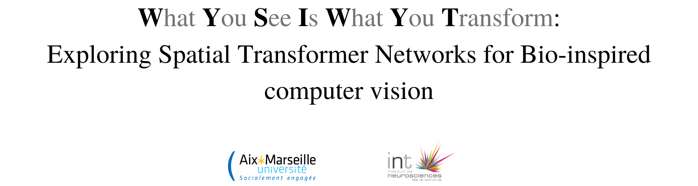

# Project
- Master's 1 internship, [BraiNets](https://brainets.github.io/) team, Institut de Neurosciences de la Timone [(INT, Marseille, France)](http://www.int.univ-amu.fr/).
- Supervised by [Emmanuel Daucé](http://emmanuel.dauce.free.fr/) (MC, Ecole Centrale Marseille).
- Description of my internship project:

> In contrast with computer vision, biological vision is characterized by an anisotropic sensor (**The Retina**) as well as the ability to **move** the eyesight to   different locations in the visual scene through ocular **saccades**. To better understand how the human eye analyzes visual scenes, a bio-inspired artificial  vision  model was recently suggested by ***Daucé et al (2020) 1***.The goal of this master’s internship would be to compare the results obtained by Daucé et   al with some of the more classical attentional computer vision models like the ***Spatial transformer network 2*** where the visual input undergoes a foveal deformation.

# Results

## The Generic Spatial Transformer Network Vs. The What pathway1

### Exploring the 28x28 Noisy MNIST dataset. 

> Taking a look at a few examples from the dataset:

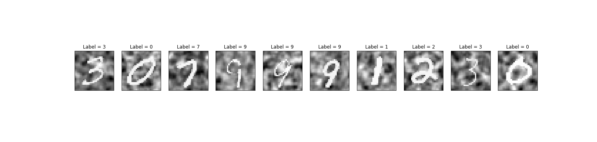

### STN_28x28
- ***Spatial Transformer: 2 convolutional layers in localization network (ConvNet), grid sampler without downscaling (28x28 pixels) &#8594;  (affine transformations) = 6 parameters***

- Training for 160  epochs with SGD, learning rate of 0.01 without decay, Each 10 epochs, increment the shift standard deviation by 1 [0, 15].

> Training statistics:

### Performance

- **Overall results**: *Central* accuracy of **88%** and *general* accuracy of **43%**, compared to **84%** and **34%** in the generic what pathway, respectively.

> Accuracy map comparaison with the generic what pathway from the paper with the same training parameters:

Spatial Transformer Network             |  Generic What pathway 1
:-------------------------:|:-------------------------:
  |  

> A test on a noisy dataset with a shift standard deviation = 7

## Spatial Transformer Networks Vs. The What/Where pathway1

### Exploring the 128x128 Noisy MNIST dataset 1.

> Taking a look at a few examples:

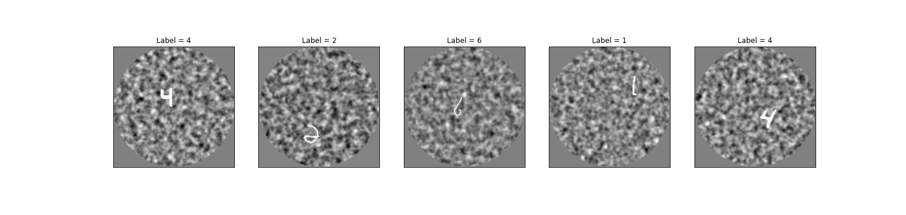

### STN_128x128 
- ***Spatial Transformer: 4 convolutional layers in localization network (ConvNet), grid sampler without downscaling (128x128 pixels) &#8594;   (affine transformations) = 6 parameters***
> Training for 110 epochs with an initial learning rate of 0.01 that decays by a factor of 10 every 30 epochs, each 10 epochs increase the standard deviation of the eccentricity, last 20 epochs vary the contrast.

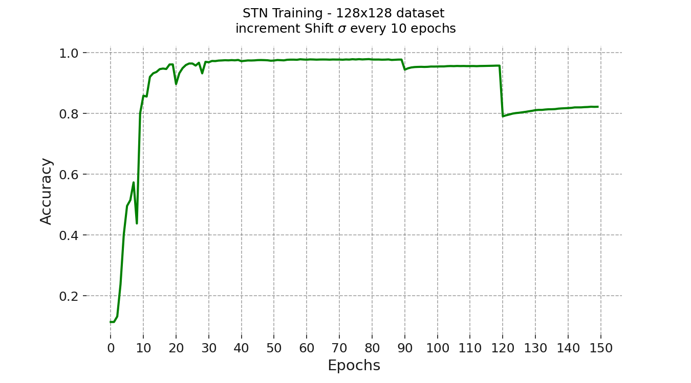

> After transformation with a STN:

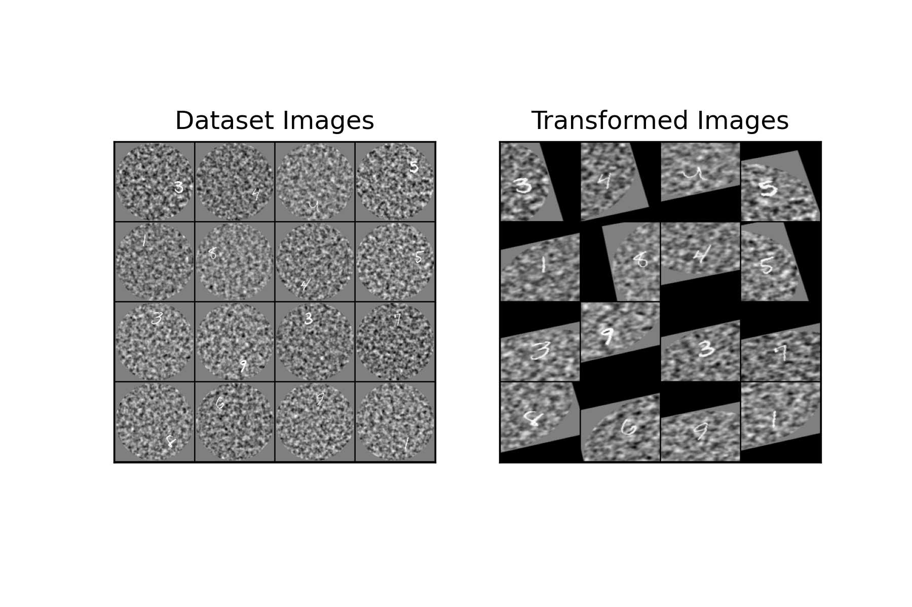

> Performance when the contrast varies between 30-70% and the digit is shifted by 40 pixels (the maximum amount):

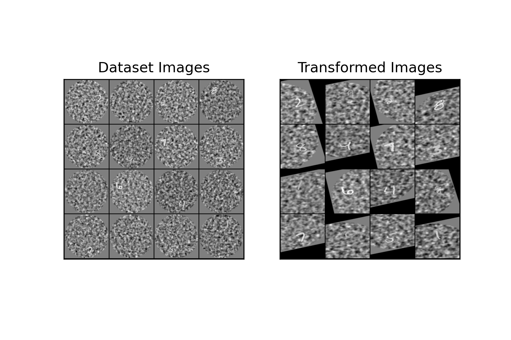

### ATN

- ***Spatial Transformer: 4 convolutional layers in localization network (ConvNet), grid sampler with downscaling (28x28 pixels) &#8594;   (attention) = 3 parameters***

> Training for 110 epochs with an initial learning rate of 0.01 that decays by a half every 10 epochs, each 10 epochs increase the standard deviation of the eccentricity, last 20 epochs vary the contrast.

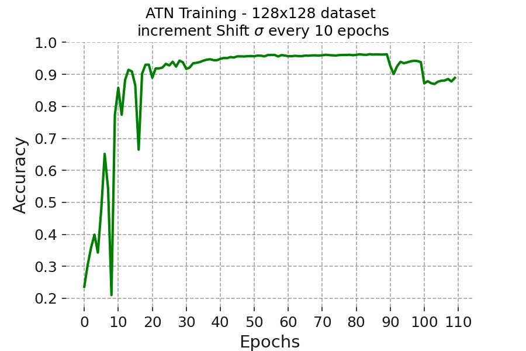

> After transformation with a ATN (STN parametrized for attention), the digit is shifted by 40 pixels to check if the network can catch it:

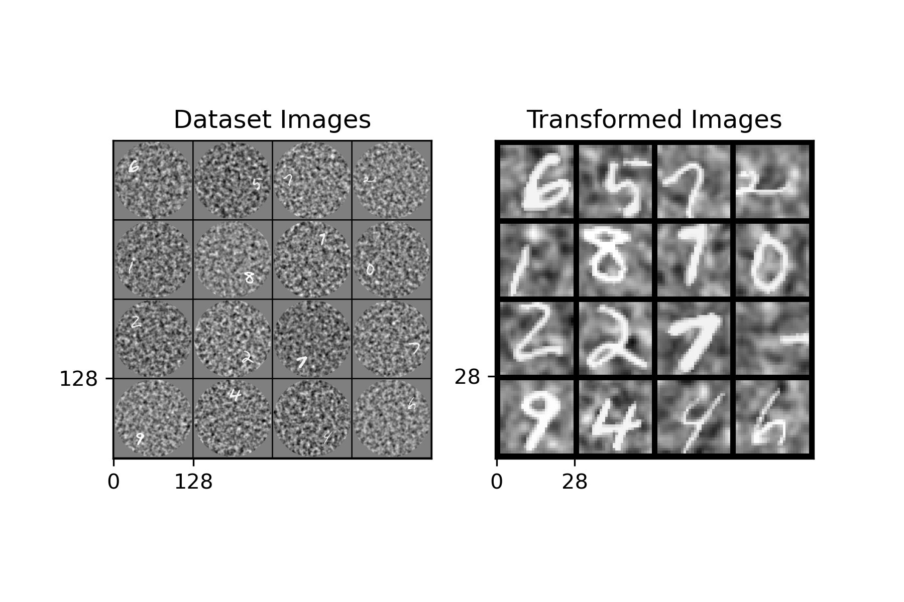

> Performance when the contrast is 30 and the digit is shifted by 40 pixels (the maximum amount):

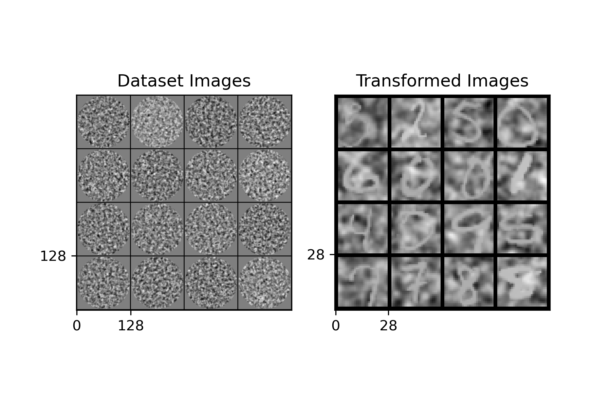

### POLO_ATN

- ***Spatial Transformer: 2 fully-connected layers in localization network (FeedForward Net), grid sampler with downscaling (28x28 pixels) &#8594;   (fixed attention) = 2 parameters***

> Polar-Logarithmic compression: the filters were placed on [theta=8, eccentricity=6, azimuth=16], on 768 dimensions, providing a compression of 
~**95%**, the original what/where model had 2880 filters, with a lesser compression rate of ~**83%**.

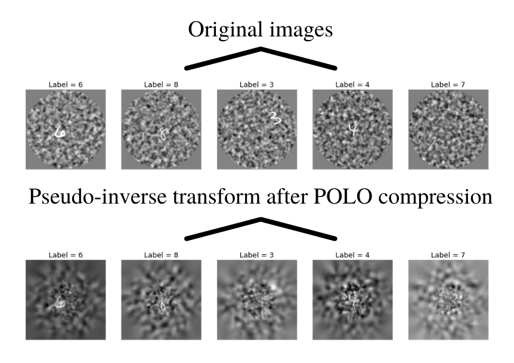

> Training for 110 epochs with an initial learning rate of 0.005 that decays by a half every 10 epochs, each 10 epochs increase the standard deviation of the eccentricity, last 20 epochs vary the contrast.

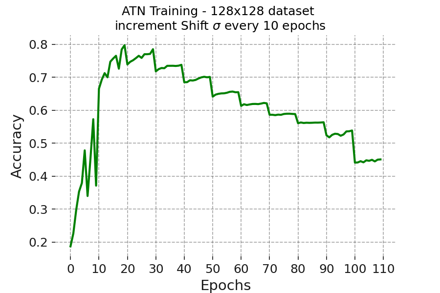

> After transformation with a POLO-ATN, the digit is shifted by 40 pixels to check if the network can catch it:

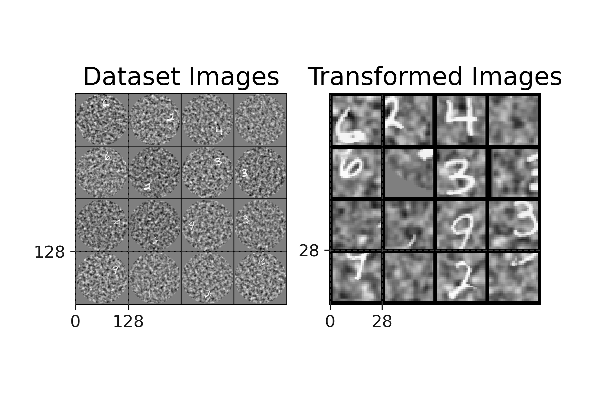

### Benchmark

> Accuracy comparison of spattial transformer networks with the What/Where model, in function of contrast and eccentricity of the digit on the screen.

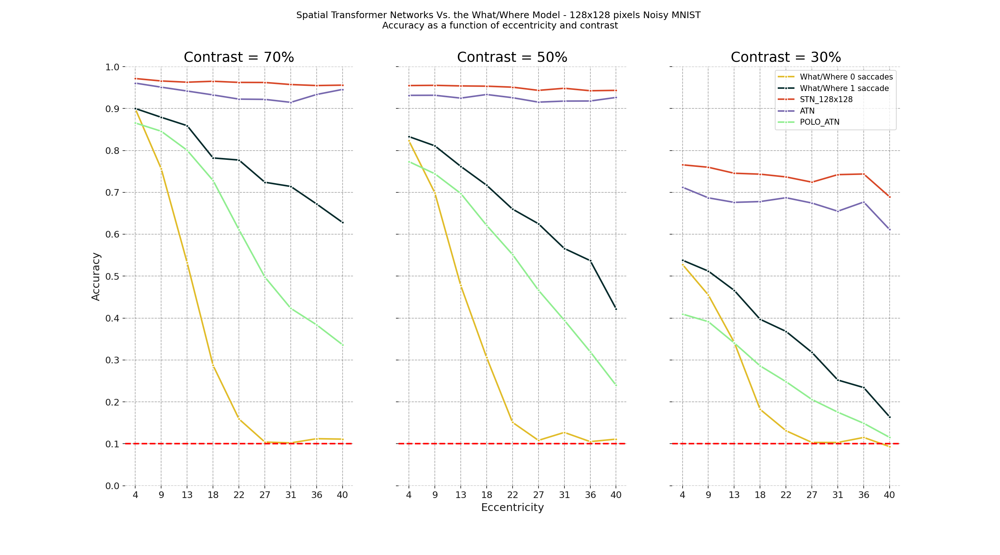

# References

[*[1] Emmanuel Daucé, Pierre Albiges, Laurent U. Perrinet; A dual foveal-peripheral visual processing model implements efficient saccade selection. Journal of Vision 2020;20(8):22.*](https://jov.arvojournals.org/article.aspx?articleid=2770680)

[*[2] Max Jaderberg, Karen Simonyan, Andrew Zisserman, Koray Kavukcuoglu; Spatial Transformer Networks. arXiv:1506.02025*](https://arxiv.org/abs/1506.02025)
