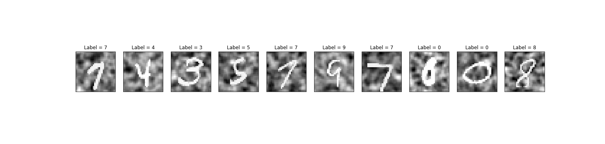
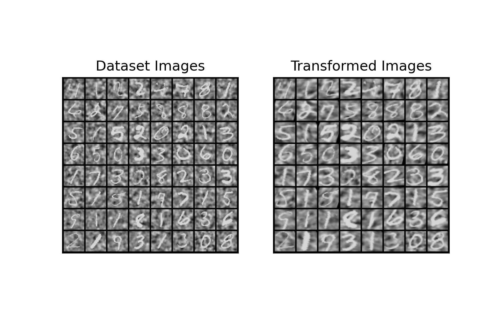

# My INT lab-book

- My personal lab-notebook for my internship at the Institut de Neurosciences de la Timone [(INT, Marseille, France)](http://www.int.univ-amu.fr/).
- Supervised by [Emmanuel Daucé](http://emmanuel.dauce.free.fr/) (MC, Ecole Centrale Marseille).
- Description of my internship project:

> In contrast with computer vision, biological vision is characterized by an anisotropic sensor (**The Retina**) as well as the ability to **move** the eyesight to   different locations in the visual scene through ocular **saccades**. To better understand how the human eye analyzes visual scenes, a bio-inspired artificial  vision  model was recently suggested by ***Daucé et al (2020) 1***.The goal of this master’s internship would be to compare the results obtained by Daucé et   al with some of the more classical attentional computer vision models like the ***Spatial transformer network 2*** where the visual input undergoes a foveal   deformation.

# Preliminary results

## 28x28 Noisy MNIST without a shift (i_offset ==0  && j_offset == 0)

> A few examples from the dataset:

> After transformation with a STN:

# Tasks
## **Week 1** - *5th to 12th April, 2021*

- [x] Setting up a notebook repo on github. 
- [x] Knocking down a few pages from Andriy Burkov's Hundred page machine learning book. 
- [x] Installing CUDA toolkit and PyTorch. 

- [x] Reading up on Spatial Transformers:
  - [x] Reading the original 2015 paper2 
  - [x] Finish up a [presentation](https://youtu.be/6NOQC_fl1hQ). 
  - [x] Reading The PyTorch tutorial [here](https://pytorch.org/tutorials/intermediate/spatial_transformer_tutorial.html). 

- [x] Meeting with the supervisor, wednesday april 7th, 10 a.m. 
- [x] Checking the source code of the What/Where network [repo](https://github.com/laurentperrinet/WhereIsMyMNIST). 
- [x] Checking some Pytorch tutorials. 
  - [x] Official Tutorial [here](https://pytorch.org/tutorials/beginner/basics/intro.html) 
- [x] Thinking about a way to integrate the STN module into the What/Where model &#8594; Reproducing Figure 4 from the original paper 1. 
- [ ] Preparing slides for the first oral presentation at friday. (post-poned till the 16th) 🚩

- [x] Feeding the MNIST specially modified dataset in a STN. (28x28 with Shift, mask and MotionClouds):
    - [ ] Success rate can't go above 11% on a noisy 28x28, must rethink strategy.
    - [x] Success rate of 94% on a noisy without shift 28x28 dataset. 

- [ ] Factorizing STN : 🚩
  - [x] Separate it into a .py file.
  - [ ] Documentation 🚩

- [ ] Modifying the CNN architecture of the Localization network (in the STN) to take into account the noisy 128x128 input.

## **Week 2** - *12th to 19th April, 2021*

# Papers

[*[1] Emmanuel Daucé, Pierre Albiges, Laurent U. Perrinet; A dual foveal-peripheral visual processing model implements efficient saccade selection. Journal of Vision 2020;20(8):22.*](https://jov.arvojournals.org/article.aspx?articleid=2770680)

[*[2] Max Jaderberg, Karen Simonyan, Andrew Zisserman, Koray Kavukcuoglu; Spatial Transformer Networks. arXiv:1506.02025*](https://arxiv.org/abs/1506.02025)

# Miscellaneous

- DeepMind's NIPS 2015 Video experiment on STNs [here](https://drive.google.com/file/d/0B1nQa_sA3W2iN3RQLXVFRkNXN0k/view)
