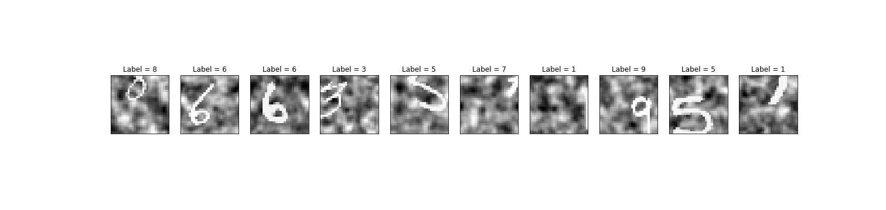
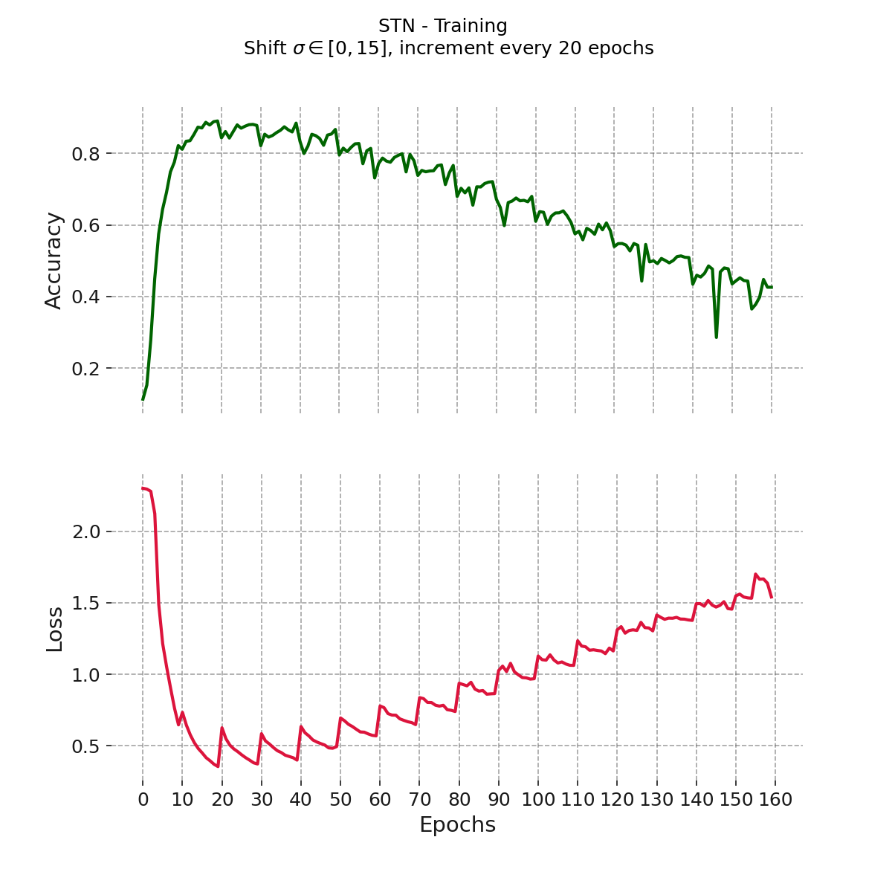
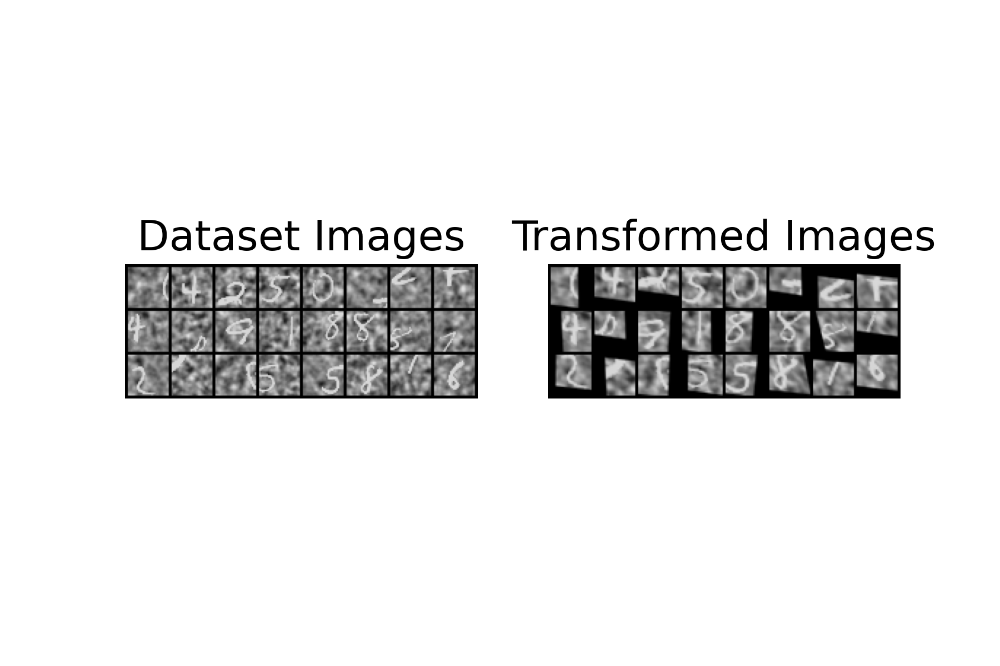
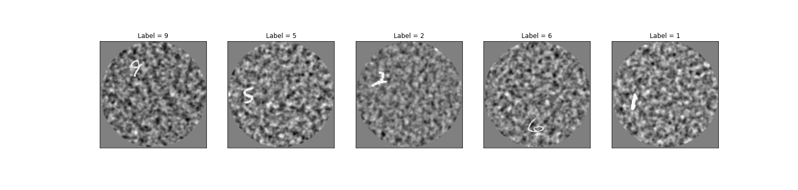
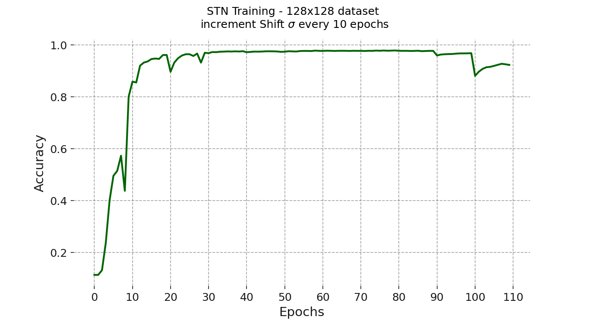
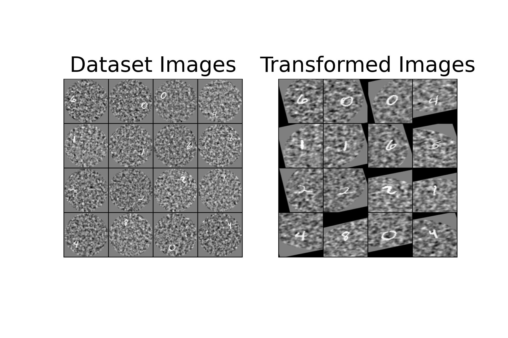
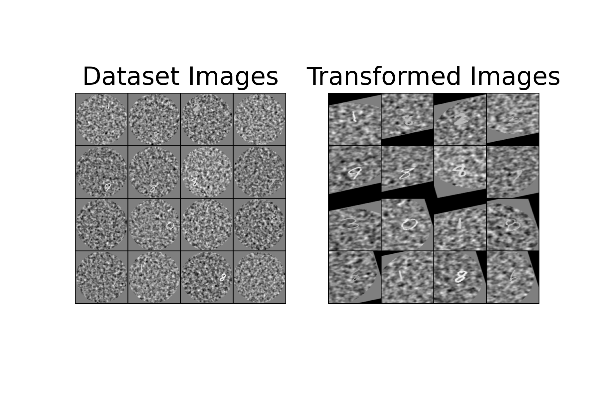
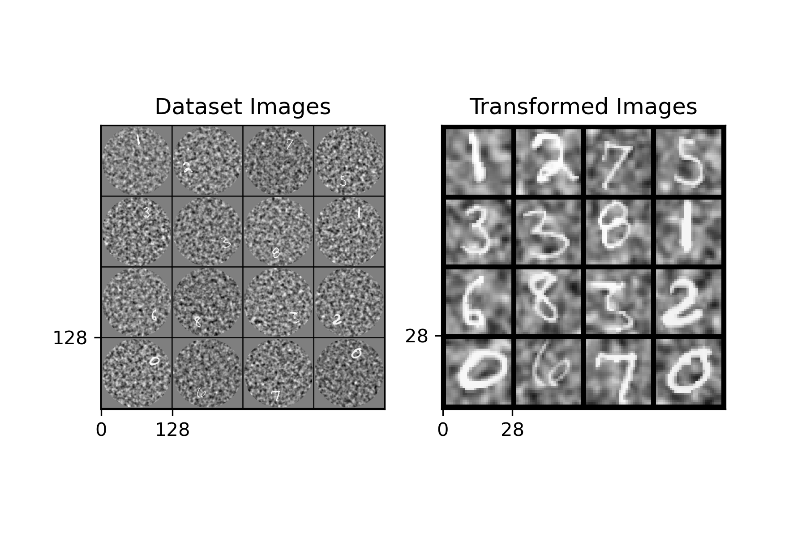
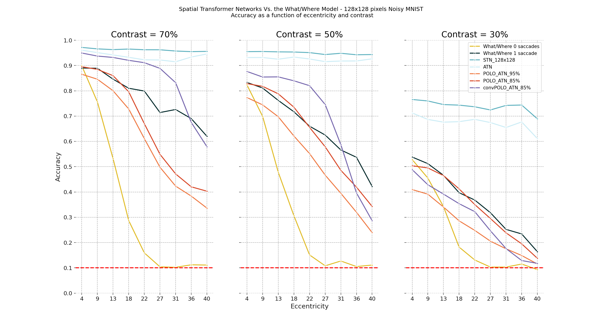

# Project
- Master's 1 internship, [BraiNets](https://brainets.github.io/) team, Institut de Neurosciences de la Timone [(INT, Marseille, France)](http://www.int.univ-amu.fr/).
- Supervised by [Emmanuel Daucé](http://emmanuel.dauce.free.fr/) (MC, Ecole Centrale Marseille).
- Description of my internship project:

> In contrast with computer vision, biological vision is characterized by an anisotropic sensor (**The Retina**) as well as the ability to **move** the eyesight to   different locations in the visual scene through ocular **saccades**. To better understand how the human eye analyzes visual scenes, a bio-inspired artificial  vision  model was recently suggested by ***Daucé et al (2020) 1***.The goal of this master’s internship would be to compare the results obtained by Daucé et   al with some of the more classical attentional computer vision models like the ***Spatial transformer network 2*** where the visual input undergoes a foveal deformation.

# Results

## The Generic Spatial Transformer Network Vs. The What pathway1

### Exploring the 28x28 Noisy MNIST dataset. 

> Taking a look at a few examples from the dataset:

### Training
- 28x28 Noisy MNIST dataset, with a digit shift standard deviation within the range [0, 15].
- While training, Each 20 epochs, increment the shift standard deviation by 1 (SGD).

> Training statistics:

### Performance

- **Overall results**: *Central* accuracy of **88%** and *general* accuracy of **43%**, compared to **84%** and **34%** in the generic what pathway, respectively.

> Accuracy map comparaison with the generic what pathway from the paper with the same training parameters:

Spatial Transformer Network             |  Generic What pathway 1
:-------------------------:|:-------------------------:
  |  

> A test on a noisy dataset with a shift standard deviation = 7

## Spatial Transformer Networks Vs. The What/Where pathway1

### Exploring the 128x128 Noisy MNIST dataset 1.

> Taking a look at a few examples:

### STN_128x128 (Affine STN) 
> Training for 110 epochs with a starting learning rate of 0.01 that decays by a factor of 10 every 30 epochs, each 10 epochs increase the standard deviation of the eccentricity, last 20 epochs vary the contrast.

> After transformation with a STN:

> Performance when the contrast varies between 30-70% and the digit is shifted by 40 pixels (the maximum amount):

### ATN (Attention-parametrized STN with 28x28 Downsampling)

> Training for 110 epochs with a starting learning rate of 0.01 that decays by a half every 10 epochs, each 10 epochs increase the standard deviation of the eccentricity, last 20 epochs vary the contrast.

> After transformation with a ATN (STN parametrized for attention), the digit is shifted by 40 pixels to check if the network can catch it:

> Performance when the contrast is 30 and the digit is shifted by 40 pixels (the maximum amount):

### POLO-ATN (Polar-Logarithmic input for Attention-parametrized STN with 28x28 Downsampling)

> Polar-Logarithmic compression: the filters were placed on [theta=8, eccentricity=6, azimuth=16], on 768 dimensions, providing a compression of 
~**95%**, the original what/where model had 2880 filters, with a lesser compression rate of ~**83%**.

> Training for 110 epochs with a starting learning rate of 0.005 that decays by a half every 10 epochs, each 10 epochs increase the standard deviation of the eccentricity, last 20 epochs vary the contrast.

> After transformation with a POLO-ATN, the digit is shifted by 40 pixels to check if the network can catch it:

### Benchmark

> Accuracy comparison of spattial transformer networks with the What/Where model, in function of contrast and eccentricity of the digit on the screen.

# References

[*[1] Emmanuel Daucé, Pierre Albiges, Laurent U. Perrinet; A dual foveal-peripheral visual processing model implements efficient saccade selection. Journal of Vision 2020;20(8):22.*](https://jov.arvojournals.org/article.aspx?articleid=2770680)

[*[2] Max Jaderberg, Karen Simonyan, Andrew Zisserman, Koray Kavukcuoglu; Spatial Transformer Networks. arXiv:1506.02025*](https://arxiv.org/abs/1506.02025)

[*[3] Ethan Harris, Mahesan Niranjan, Jonathon Hare; Foveated Convolutions: Improving Spatial Transformer Networks by Modelling the Retina.	1st Workshop on Shared Visual Representations in Human and Machine Intelligence (SVRHM), NeurIPS 2019.*](https://eprints.soton.ac.uk/441204/1/5_CameraReadySubmission_workshop.pdf)

[*[4] Alexey Dosovitskiy, Lucas Beyer, Alexander Kolesnikov, Dirk Weissenborn, Xiaohua Zhai, Thomas Unterthiner, Mostafa Dehghani, Matthias Minderer, Georg Heigold, Sylvain Gelly, Jakob Uszkoreit, Neil Houlsby; An Image is Worth 16x16 Words: Transformers for Image Recognition at Scale.	arXiv:2010.11929*](https://arxiv.org/pdf/2010.11929.pdf)

[*[5] Lecun, Y., Bottou, L., Bengio, Y., & Haffner, P. (1998). Gradient-based learning applied to document recognition. Proceedings of the IEEE, 86, 2278–2324, doi:10/d89c25*](https://ieeexplore.ieee.org/document/726791/)

[*[6] Paszke, A., Gross, S., Massa, F., Lerer, A., Bradbury, J., Chanan, G., … Chintala, S. (2019). PyTorch: An imperative style, high-performance deep learning library. In Wallach, H., Larochelle, H., Beygelzimer, A., d'Alché-Buc, F., Fox, E., Garnett, R. (Eds.), Advances in neural information processing systems 32 (pp. 8024–8035). Long Beach Convention Center, Long Beach: Curran Associates, Inc.*](https://arxiv.org/abs/1912.01703)

[*[7] Mishkin, M., Ungerleider, L. G., & Macko, K. A. (1983). Object vision and spatial vision: Two cortical pathways. Trends in Neurosciences, 6, 414–417.*](https://www.sciencedirect.com/science/article/abs/pii/016622368390190X?via%3Dihub)

# Miscellaneous

- DeepMind's NIPS 2015 Video experiment on STNs [here](https://drive.google.com/file/d/0B1nQa_sA3W2iN3RQLXVFRkNXN0k/view)
- What/Where model 1 paper github repo [here](https://github.com/laurentperrinet/WhereIsMyMNIST)
- Foveated convolutions 3 paper github repo [here](https://github.com/ethanwharris/foveated-convolutions)
