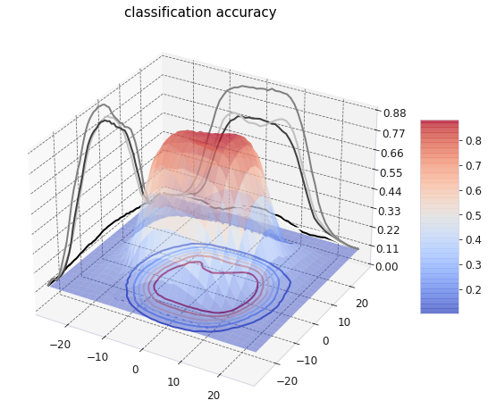
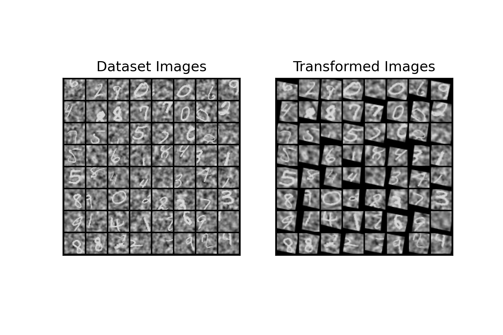

# INT M1 Internship

- Supervised by [Emmanuel Daucé](http://emmanuel.dauce.free.fr/) (MC, Ecole Centrale Marseille).
- Description of my internship project:

> In contrast with computer vision, biological vision is characterized by an anisotropic sensor (**The Retina**) as well as the ability to **move** the eyesight to   different locations in the visual scene through ocular **saccades**. To better understand how the human eye analyzes visual scenes, a bio-inspired artificial  vision  model was recently suggested by ***Daucé et al (2020) 1***.The goal of this master’s internship would be to compare the results obtained by Daucé et   al with some of the more classical attentional computer vision models like the ***Spatial transformer network 2*** where the visual input undergoes a foveal   deformation.

# Preliminary results

## 28x28 Noisy trained on a shift std from 0-15 (over 80 epochs like the generic what pathway)

- Central accuracy of **93%** and general accuracy of **45%**, compared to **84%** and **34%** in the generic what pathway, respectively.

> Training statistics:

> Accuracy map comparaison with the generic what pathway from the paper with the same training parameters:

Spatial Transformer Network             |  Generic What pathway 1
:-------------------------:|:-------------------------:
  |  

## 28x28 Noisy MNIST without a shift (i_offset ==0  && j_offset == 0)

> A few examples from the dataset:

> After transformation with a STN:

# Papers

[*[1] Emmanuel Daucé, Pierre Albiges, Laurent U. Perrinet; A dual foveal-peripheral visual processing model implements efficient saccade selection. Journal of Vision 2020;20(8):22.*](https://jov.arvojournals.org/article.aspx?articleid=2770680)

[*[2] Max Jaderberg, Karen Simonyan, Andrew Zisserman, Koray Kavukcuoglu; Spatial Transformer Networks. arXiv:1506.02025*](https://arxiv.org/abs/1506.02025)

[*[3] Alexey Dosovitskiy, Lucas Beyer, Alexander Kolesnikov, Dirk Weissenborn, Xiaohua Zhai, Thomas Unterthiner, Mostafa Dehghani, Matthias Minderer, Georg Heigold, Sylvain Gelly, Jakob Uszkoreit, Neil Houlsby; An Image is Worth 16x16 Words: Transformers for Image Recognition at Scale.	arXiv:2010.11929*](https://arxiv.org/pdf/2010.11929.pdf)

# Miscellaneous

- DeepMind's NIPS 2015 Video experiment on STNs [here](https://drive.google.com/file/d/0B1nQa_sA3W2iN3RQLXVFRkNXN0k/view)
