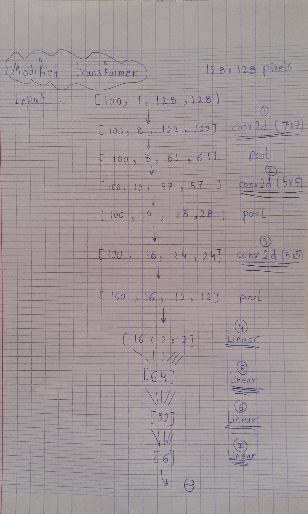
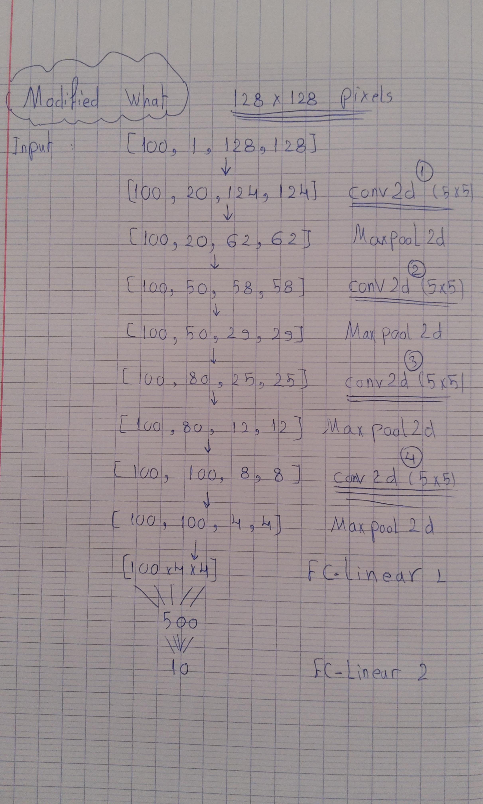

# My INT lab-book

- My personal lab-notebook for my internship at the Institut de Neurosciences de la Timone [(INT, Marseille, France)](http://www.int.univ-amu.fr/).

# Tasks

## **Week 1** - *5th till 11th of April, 2021*

- [x] Setting up a notebook repo on github. 
- [x] Knocking down a few pages from Andriy Burkov's Hundred page machine learning book. 
- [x] Installing CUDA toolkit and PyTorch. 

- [x] Reading up on Spatial Transformers:
  - [x] Reading the original 2015 paper2 
  - [x] Finish up a [presentation](https://youtu.be/6NOQC_fl1hQ). 
  - [x] Reading The PyTorch tutorial [here](https://pytorch.org/tutorials/intermediate/spatial_transformer_tutorial.html). 

- [x] Meeting with the supervisor,**Wednesday april 7th, 10:00**. 
- [x] Checking the source code of the What/Where network [repo](https://github.com/laurentperrinet/WhereIsMyMNIST). 
- [x] Checking some Pytorch tutorials. 
  - [x] Official Tutorial [here](https://pytorch.org/tutorials/beginner/basics/intro.html) 
- [x] Thinking about a way to integrate the STN module into the What/Where model &#8594; Reproducing Figure 4 from the original paper 1. 

- [x] Feeding the MNIST specially modified dataset in a STN. (28x28 with Shift, mask and MotionClouds):
    - [x] Success rate can't go above 11% on a noisy 28x28, must rethink strategy.
    - [x] Success rate of 94% on a noisy without shift 28x28 dataset. 

- [x] Factorizing STN : 
  - [x] Separate it into a .py file.
  - [x] Documentation

- [x] Starting the Deep learning with Pytorch book to get a better grip of what's happening.

- [x] Integrated LeNet Network with the Spatial Transformer and Test on a 28x28 Noisy MNIST with eccentricity of 2.
- [x] A second meeting with M. Daucé and M. Perrinet, **Friday, 10:15**.
- [x] First BraiNets team meeting
- [x] Train the STN on a shift dependant dataset like the generic what pathway in the article.
- [x] Reproduce the classification accuracy map with the same range as the what network.

## **Week 2** - *12th till 18th of April, 2021*

- [x] Factorizing Spatial Transformer Module and Documentation.

- [x] Reading up on CNNs.
    - [x] Colah's blog article [here](http://colah.github.io/posts/2014-07-Conv-Nets-Modular/)
    - [x] A good medium article on convolutions [here](https://towardsdatascience.com/intuitively-understanding-convolutions-for-deep-learning-1f6f42faee1)
    - [x] Computerphile videos
    - [x] A medium article on parameters [here](https://towardsdatascience.com/understanding-and-calculating-the-number-of-parameters-in-convolution-neural-networks-cnns-fc88790d530d)
  
- [x] Preparing slides for the first oral presentation at friday.
- [x] Second BraiNets team meeting.

- [x] 28x28 STN can't apply different crops, find out why:
  - [x] Tried on 20 epochs instead of 5 on a single value of shift std (0 and 5), **failed**.
  - [x] Tried changing the structure of the network, **failed**.
  - [x] Tried changing the loss function, **failed**.
  - [x] Tried changing the optimizer, **worked**.

- [x] Meeting with the head of Polytech computer science engineering school, **Wednesday, 18:00**

- [x] Investigate Adam Vs. SGD:
  - [x] Check if  is the same for every input while training on Adam. **Same **
  - [x] Try Adam with Threshold = False, if it doesn't work, go with SGD. **Threshold doesn't exist**
  - [x] Adam works when setting the learning rate to the default parameter, 1e-3.
  - [x] Adam works when training on a maximum of 3 loops of standard deviation.
  - [x] When trying to process on an increasing shift std from 0 to 15, we get the same problem even when the learning rate is 1e-3.
  - [x] Maybe just try and go with SGD anyways. 
 
- [x] Meeting with M. Daucé, **Friday, 10:00**
- [x] Retrained the 28x28 network with SGD, even a better performance (ofcourse).
- [x] Presentation about the internship (overview or general approach), **Friday, 15:10**
- [x] A RDV with a professor in M2 Artificial intelligence study path, **Friday, 13:00**
- [x] Recalculate the accuracy map.

## **Week 3** - *19th till 25th of April, 2021*

- [x] Reading the paper about NLP transformers on images3
- [x] Third BraiNets team meeting.
- [x] Tried taking out bias terms in the spatial transformer to see if Adam works. **Adam still can't work**
- [x] Replacing the results with SGD results (way better, yay!).
- [x] Cleaning the repository a little bit.
- [x] Adding a new repository to store some old notebooks and figures that are not used.
- [x] Understanding how tensors change with convulutions and max pooling (on paper).
- [x] Modifying the CNN architecture of the Localization network (in the STN) to take into account the noisy 128x128 input.
  - [x] Tried adding 2 conv layers to the what network and 1 conv layer to the localization network, **Training is hard, but seems to work!!!!**.
  > The new architecture (to be verified by M. Daucé)
 
Modified transformer |  Modified What
:-----------------------:|:--------------:
|

- [x] Trained the new architecture for 25 epochs without a shift, **It takes 2-3 hours, worked, 98% accuracy achieved**.
- [x] Went back to the old repository to explore what is eccentricity and different parameters of contrast chosen for figure 4.
- [x] Meeting with M. Daucé, **Thursday, 14:00**

- [x] Trying to take out one fully connected layers in the Spatial Transformer and see how it performs, **Works** 
 
- [x] Reread the original paper to investigate the structure.

- [x] Factored view_dataset() in a function in utils.py
 

## **Week 4** - *26th of April till 2nd of May, 2021*

- [x] **PROBLEM WITH THE ARCHITECHTURE**, accuracy increases then drops at final epochs.
    - [x] Tried training with Adam, **not working**.
    - [x] Tried to add kernels in the localization network, **not working**.
    - [x] Tried with a different learning rate, **not working**.
    - [x] Overfitting?, maybe add a dropout layer..., **Seems to work this time but maybe due to chance, thetas are the same like with Adam**. 
    - [x] Implemented the TC architechture from the paper 🤞
    - [x] Training directly on the translated dataset, **fail**.
- [x] Persisting problem with the architechture, **tried varying everything**.
- [x] Same training scheme as the 28x28, increasing eccentricity.
    - [x] Trained on eccentricity 0 (radius=0).
    - [x] Trained on all eccentricities, **problem, accuracy drops sharply and nothing works**.
- [x] Took out a linear layer and modified kernels.
- [x] Trained on 20 epochs with SGD 0.1, 96% accuracy but still the same theta.
- [x] Added foveated convolution layer class. 
- [x] same theta while training on higher radius, doesn't really crops, only classifies,**rethink strategy**. 
- [x] Taken out 2 conv layers from the classification net, same performance on adam, but still adam never transforms.
- [x] **After taking out the 2 conv layers from the classification net, and training on sgd with 0.1 for 20 epochs on the eccentricity 4.44444, this time it seems to work, different thetas for different inputs, finally**
- [x] Training the new network on all eccentricities, **seems to work, have to retrain on everything, FINALLY**.
- [x] Trained on 8 eccentricities between 4 and 40,5 epochs each, overfitting or converging to the same theta.
- [x] Training on less eccentricites to see what happens. maybe 4 eccentricites, 10,20,30,40 and 3 epochs each.
- [x] Trained on all eccentricites like the paper, SGD with 0.001, works like the charm, but another problem surfaced, **the model is biased towards 40 pixel eccentricity**.
- [x] A default in Spatial Trans Nets, must think about FoveaNet.
- [x] Use std parameter instead of radius.
- [x] Retrain with sgd with a learning rate scheduler. **EVERYTHING SEEMS WONDERFUL**
    - [x] Trained on first 3 eccentricities 10 epochs each, **Works like a charm**.
    - [x] Verified the transformations and the accuracies of all first 3 and saved the model. 
    - [x] Trained on second 3 eccentricites with a learning rate divided by 10.
    - [x] Verified the transformations and the accuracies of the second 3 and saved the model. 
    - [x] Trained on last 3 eccentricites with a learning rate divided by 100.
    - [x] Verified the transformations and the accuracies of the last 3 eccentricites and saved the final model.
- [x] Refactored the Spatial Net of the 128x128 dataset.

- [x] Training on lesser contrasts, **seems to work with only 10 epochs each, and on the 40 std shift**.
- [x] Add an interpolate to mimic the fovea, **interpolation works when on visualizing**.

## **Week 5** - *3rd till 9th of May, 2021* 

- [x] Fixed the problem with the benchmark empty plot.
- [x] Replaced all figures with the new cool julia-like plotting style.
- [x] Verify with M. Daucé that the training scheme for the 128x128 is good on all contrasts.
  - [x] Retrain with variable contrast on all epochs from the beginning to see if it's better, **doesn't work**.
- [x] Trained the network for 10 more epochs, **a slight improvement**.
- [x] Tried training with a grid size of 28x28 to downsample, **failed, in the paper they talk about aliasing effects**.
- [x] Tried training directly on a dataset with various contrast from the beginning, **failed**.  
- [x] Final training, train the network for 60 more epochs on various contrasts, **no improvement**.
- [x] Start preparing slides for BraiNets meeting.
- [x] Meeting with M. Daucé at the lab.
- [x] Continue working on slides.
- [x] Finish Slides.

## **Week 6** - *10th till 16th of May, 2021*🚩

- [x] Projet presentation, **Monday, 14h30**.
- [x] Read the two notebooks of bicv to understand log-polar coding.
- [x] ***Try Attention Model***.
  - [x] Used attention matrix, **seems to work, yay!**. 
  - [x] Adam coverges to a weird inversed scaling local minimum, **go back to sgd**.
  - [x] Training on SGD with 0.01, **not stable, maybe lr is too big?**.
  - [x] Tried 0.001 with SGD, **too small, can't find mimina**.
  - [x] Trying 0.005 SGD like in the original paper **Works, but we have overfitting**.
  - [x] Training on 0.002, **too slow**.
  - [x] Training on 0.01 seems good and faster, but still overfitting, **NO**.
  - [x] **Architechture too complex**? Took out conv layers from localization to handle overfitting.
    - [x] Trained on 0.01, seemed good, but sudden drop of accuracy after 14 epochs, reached 67% before.
    - [x] Trying with 0.05 for 10 epochs, doesn't work.
    - [x] Trying with 0.005 for 10 epochs, doesn't work.
    - [x] 3 convolutions instead of 4, learning seems faster, but overfitting after 6 epochs SGD with 0.01.
    - [x] Trying momentum with the previous point.
  - [x] Trying SGD 0.01, 20 epochs, 0.9 momentum and with exponential decay in lr, **nope**.
  - [x] Trying SGD 0.01, 20 epochs (for first 2 contrasts), with exponential decay in lr, 87%, converged to an inverse scaling factor like adam?????
  - [x] Retryin last point with stepLR (every 5 epochs) instead of exponentialLR.
  - [x] SGD, 0.005, stepLR every 10 epochs (0.9 gamma).
  - [x] Try to initialize scaling as 1, **No, network can't learn because we are downsampling**.
  - [x] Initialize scaling as .25 (28/128), SGD, 0.01, 20 epochs and exponential decay in lr (0.9), **it seems good**.
- [x] Start preparing slides for 2nd presentation checkup at Luminy with M. Gonzalez
- [x] Meeting with M. Daucé and M. Perrinet, **Tuesday, 14h00**.
- [x] Fixed the problem with the affine STN with retraining on a lesser lr for only 20 epochs, **even more amazing results**.
- [x] Replaced figures for affine stn.
- [x] Cleaned the repo.
- [x] Cleaned the repo a second time.
- [x] Finishing up the attention transformer.
- [x] Prepare a lab report cover.

## **Week 7** - *17th till 23rd of May, 2021*

- [x] Internship checkup presentation, **Monday, 15h50**.
- [x] Factored AttentionTransNet to a script.
- [x] Factored train and test functions.
- [x] polo-stn architechture, **must create a new one**.
  - [x] Added PYramid2 script.
  - [x] Rerun the script to see the dataset with POLO coordinates, compression ~95%.
  - [x] started a test training with the ordinary STN architechture without any change, **ofcourse it won't work, what was i thinking?**.
- [ ] New polo_stn architechture:
  - [x] An only FC localization network.
- [ ] Start the lab report.
- [ ] Final internship defense presentation.

## **Week 8** - *24th till 30th of May, 2021*
